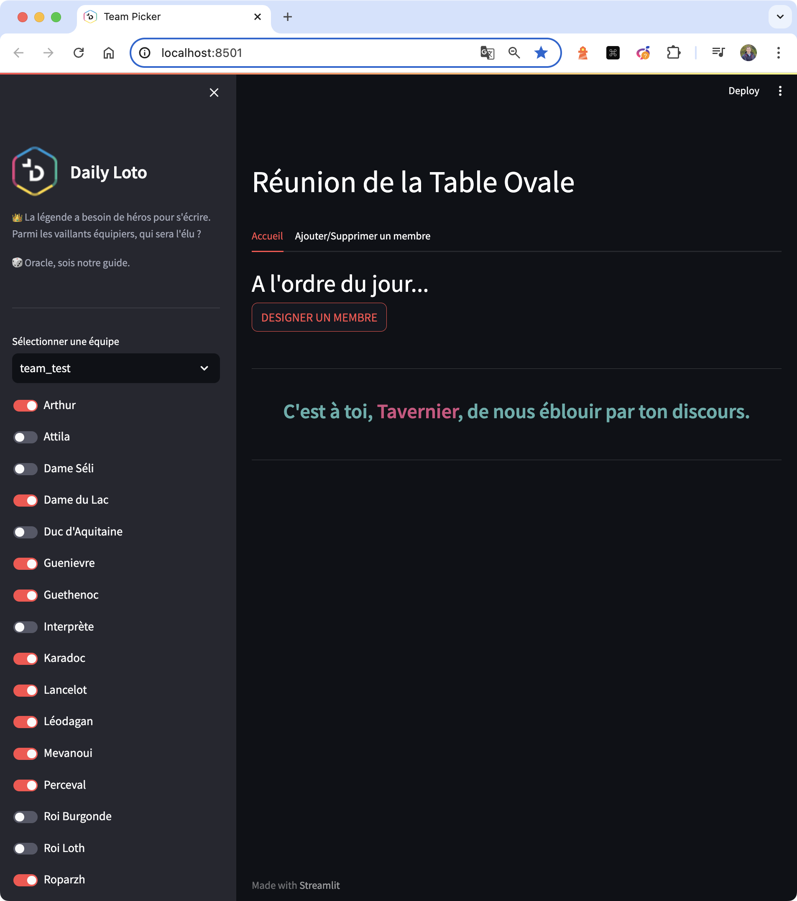

# Team Picker

## 📄 Description

🎲 Discover an application designed to randomly pick a member of your team for various activities or tasks.

🤔 “Who should be the next to speak?” This application helps answer this question by providing a fun and fair way to select a random team member. Whether it's for a meeting, a presentation, or any team activity, let chance decide!

Here's a tool that allows you to manage team members, add or remove members, and perform a random selection with a fun twist. Ideal for teams who want to add an element of surprise and fairness to their processes.

🌐 Access the app and start your random selection now at [team-picker.app](https://teampicker-a7b18094f808.herokuapp.com/).



## Prerequisites
- Anaconda or Miniconda
- Docker (for Docker deployment)

## ⚒️ Installation

### Prerequisites
- Python 3.11
- Python libraries
    ```sh
    pip install -r requirements.txt
    ```

## 📝 Usage

### Running without Docker

1. **Clone the repository and navigate to the directory**
    ```bash
    git pull https://github.com/LudovicGardy/app_team_picker
    cd team_picker_repos/app_folder
    ```

2. **Environment setup**
    - Create and/or activate the virtual environment:
        ```bash
        conda create -n myenv python=3.11
        conda activate myenv
        ```
        or
        ```bash
        source .venv/bin/activate
        ```

3. **Launch the Streamlit App**
    - Run the Streamlit application:
        ```bash
        streamlit run main.py
        ```

### Running with Docker

1. **Prepare Docker environment**
    - Ensure Docker is installed and running on your system.

2. **Navigate to project directory**
    - For multiple containers:
        ```bash
        cd [path-to-app-folder-containing-docker-compose.yml]
        ```
    - For a single container:
        ```bash
        cd [path-to-app-folder-containing-Dockerfile]
        ```

3. **Build and start the containers**
    ```bash
    docker-compose up --build
    ```

    - The application will be accessible at `localhost:8501`.

    - ⚠️ If you encounter issues with `pymssql`, adjust its version in `requirements.txt` or remove it before building the Docker image.

## 👤 Author
- LinkedIn: [Ludovic Gardy](https://www.linkedin.com/in/ludovic-gardy/)
- Website: [https://www.sotisanalytics.com](https://www.sotisanalytics.com)
